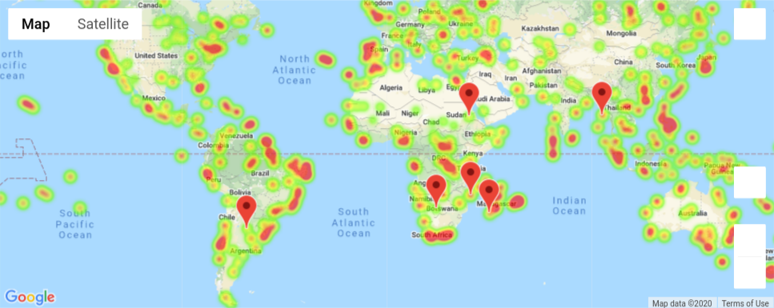

# Data API challenge

## Part I results
The summary for the results of this challenge is inline in the first part of the challenge - WeatherPy notebook.

## Part II result
The heatmap showing humidity levels and a few markers pointing to the cities with comfortable weather on the day of the research.

